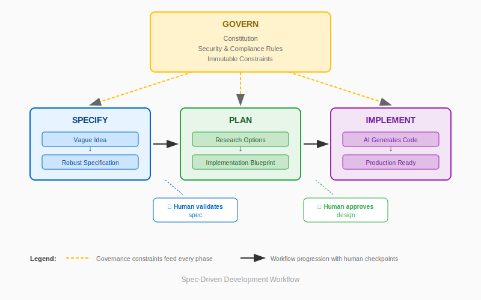

# Mastering Spec-Driven Development
{: .fs-9 }

Build production-ready software with AI assistants using specification-first methodology.
{: .fs-6 .fw-300 }

Stop hoping AI understands you. Start giving it what it needs to succeed.
{: .fs-5 .fw-300 }

[Get Started](prerequisites.html){: .btn .btn-primary .fs-5 .mb-4 .mb-md-0 .mr-2 }
[View Full Agenda](#full-course-agenda){: .btn .fs-5 .mb-4 .mb-md-0 }

---

## Why Spec-Driven Development?

AI coding assistants are powerful — but most teams struggle to get consistent results.

{: .highlight }
> **The root cause:** We ask AI to implement vague ideas instead of validated specifications.

| The Pain | What Happens |
|:---------|:-------------|
| **"It works... differently every time"** | Same prompt, different implementations |
| **"AI keeps going off the rails"** | Builds features you didn't ask for |
| **"We spend more time fixing than building"** | Requirements were unclear |
| **"Security and compliance are afterthoughts"** | AI takes shortcuts that fail audits |

---

## What is Spec-Driven Development?

Spec-Driven Development makes the thinking explicit through **human validation at every phase**. You clarify intent *before* AI writes code.

{: .note }
> **What makes this different:** The spec is not just documentation — it's a **conversation** that surfaces hidden assumptions before they become bugs.

---

## From Vague to Validated

The magic of SDD is the **clarification process**. AI doesn't guess — you decide.

| You Say | AI Asks | You Clarify | Spec Captures |
|:--------|:--------|:------------|:--------------|
| "Build a payment system" | "What payment methods?" | "Credit cards via Stripe" | Stripe tokenization, no raw PAN storage |
| | "What happens on timeout?" | "Retry 3x, then fail gracefully" | 30s timeout, exponential backoff |
| | "What's out of scope?" | "No refunds yet" | Explicit boundary prevents scope creep |
| | "How do we know it works?" | "Charge goes through, get transaction ID" | Testable acceptance criteria |

**Result:** A spec that any AI assistant can implement consistently.

---

## Your Learning Path

| Part | Focus | What You'll Build |
|:-----|:------|:------------------|
| [**Part 1: Greenfield**](labs/part1/) | Build from scratch | Working checkout system from empty repo |
| [**Part 2: Brownfield**](labs/part2/) | Transform legacy code | Integration layer for legacy monolith |

{: .important }
> **Complete [Prerequisites](prerequisites.html) before Day 1.** Setup takes 15-30 minutes.

---

## Full Course Agenda

### Part 1: Greenfield Development
{: .d-inline-block }

~6-9 hours
{: .label .label-blue }

Build a checkout system from an empty repo. Learn the spec-first discipline.

| Lab | Title | Duration | What You'll Learn |
|:----|:------|:---------|:------------------|
| **0** | [AI Without Specs](labs/part1/lab-0-ai-without-specs.html) | 45 min | Why unstructured AI fails |
| **1.1** | [Initialize & Specify](labs/part1/lab-1.1-init-and-spec.html) | 45-60 min | spec-kit setup, first specification |
| **1.2** | [Plan & Research](labs/part1/lab-1.2-plan.html) | 30-45 min | Technology decisions, trade-offs |
| **1.3** | [Implementation](labs/part1/lab-1.3-implementation.html) | 60-120 min | TDD, AI-generated code from spec |
| **1.4** | [Order Specification](labs/part1/lab-1.4-order-spec.html) | 45-60 min | Second feature, state machines |
| **1.5** | [Integration](labs/part1/lab-1.5-integration.html) | 90-150 min | Connect payment + order services |
| **1.6** | [Production Ready](labs/part1/lab-1.6-production.html) | 45-75 min | Docker, security scan, demo prep |

{: .highlight }
> **Day 1:** Labs 0 → 1.3 (contrast, specify, plan, implement)  
> **Day 2:** Labs 1.4 → 1.6 (extend, integrate, ship)

---

### Part 2: Brownfield Development
{: .d-inline-block }

~7 hours
{: .label .label-purple }

Transform a legacy monolith. Extract specs from existing code.

| Lab | Title | Duration | What You'll Learn |
|:----|:------|:---------|:------------------|
| **2.0** | [The Inherited Codebase](labs/part2/lab-2.0-inherited-codebase.html) | 45 min | Systematic legacy exploration |
| **2.1** | [Extract Specs](labs/part2/lab-2.1-extract-specs.html) | 90 min | Characterization testing |
| **2.2** | [Document Business Rules](labs/part2/lab-2.2-document-rules.html) | 60 min | Finding hidden rules in code |
| **2.3** | [Strangler Facade](labs/part2/lab-2.3-strangler-facade.html) | 90 min | API Gateway, incremental migration |
| **2.4** | [Notification Integration](labs/part2/lab-2.4-notifications.html) | 60 min | Event-driven architecture |
| **2.5** | [Unified Reporting](labs/part2/lab-2.5-unified-reporting.html) | 45 min | Cross-system data aggregation |
| **2.6** | [Migration Planning](labs/part2/lab-2.6-migration-planning.html) | 45 min | Production cutover strategy |

{: .highlight }
> **Day 3:** Labs 2.0 → 2.2 (explore, extract, document)  
> **Day 4:** Labs 2.3 → 2.6 (integrate, migrate, plan)

---

## What You'll Achieve

By the end of this course:

| Skill | Part 1 | Part 2 |
|:------|:-------|:-------|
| **Specification Writing** | Create from scratch | Extract from code |
| **AI Collaboration** | Guide implementation | Reverse-engineer behavior |
| **Testing Strategy** | TDD with spec scenarios | Characterization tests |
| **Production Readiness** | Build compliance in | Retrofit compliance |
| **Integration** | Service composition | Strangler pattern |

{: .tip }
> **The goal is mastery, not speed.** Timing varies by AI model and complexity. Implementation-heavy labs (1.3, 1.5, 2.3) are inherently variable.

---

## Ready to Begin?

[Get Started](prerequisites.html){: .btn .btn-primary .fs-5 .mb-4 .mb-md-0 .mr-2 }
