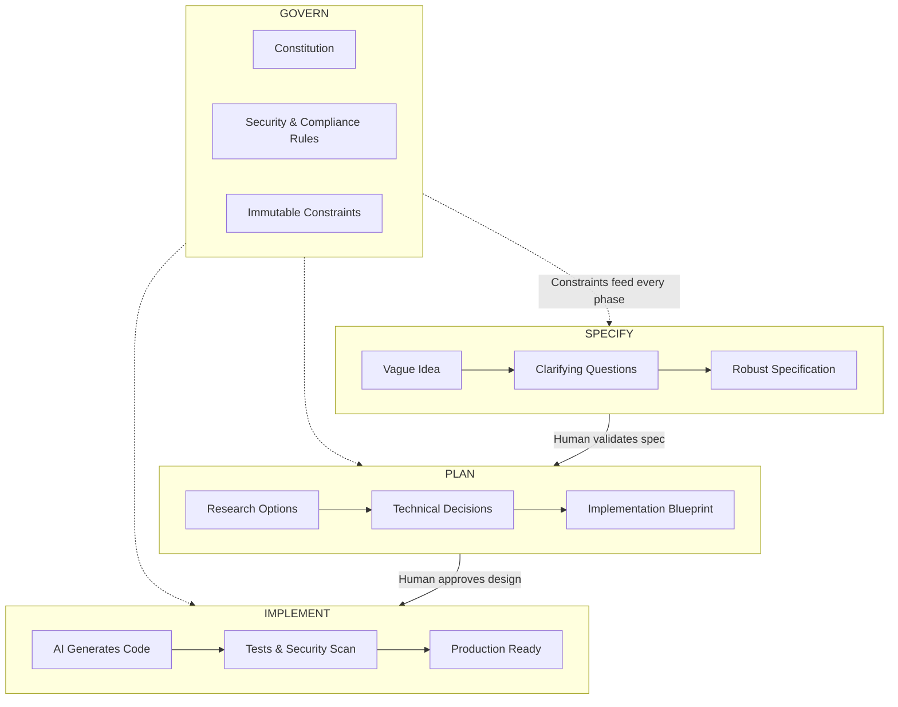

# SDD Foundations Course 1
{: .fs-9 }

From vague idea to production code in a structured workflow.
{: .fs-6 .fw-300 }

Stop hoping AI understands you. Start giving it what it needs to succeed.
{: .fs-5 .fw-300 }

[Get Started](setup){: .btn .btn-primary .fs-5 .mb-4 .mb-md-0 .mr-2 }
[View Labs](labs/){: .btn .fs-5 .mb-4 .mb-md-0 }

---

## The SDD Workflow

Most AI coding fails because we skip the thinking. SDD makes the thinking explicit through **human validation at every phase**.

**What makes this different:** The spec is not just a document -- it is a **conversation** that surfaces hidden assumptions before they become bugs.

---

## From Vague to Validated

The magic of SDD is the **clarification process**. AI does not guess -- you decide.

| You Say | AI Asks | You Clarify | Spec Captures |
|:--------|:--------|:------------|:--------------|
| "Build a payment system" | "What payment methods?" | "Credit cards via Stripe" | Stripe tokenization, no raw PAN storage |
| | "What happens on timeout?" | "Retry 3x, then fail gracefully" | 30s timeout, exponential backoff, user notification |
| | "What's out of scope?" | "No refunds yet" | Explicit boundary prevents scope creep |
| | "How do we know it works?" | "Charge goes through, get transaction ID" | Testable acceptance criteria |

**Result:** A spec that any AI assistant can implement consistently.

---

## Your Journey This Week

| Phase | What Happens | The Shift |
|:------|:-------------|:----------|
| **Contrast** | Try AI coding without specs | Feel the frustration of inconsistent output |
| **Specify** | Write your first real spec | Experience how questions clarify intent |
| **Plan** | Make technical decisions explicit | See how constraints guide AI choices |
| **Implement** | AI generates compliant code | Watch the spec translate to working software |
| **Integrate** | Add a second feature | Prove the approach scales |
| **Ship** | Production-ready artifact | Demo something you'd actually deploy |

By Friday, you'll have a working checkout system and a repeatable process.

{: .important }
> **Complete [Pre-Course Setup](setup) before Day 1.** You'll need your environment ready.

[Start the Labs](labs/){: .btn .btn-outline .fs-5 }

