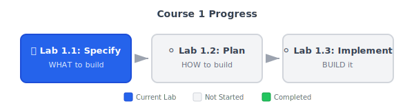

# Lab 1.1: Init and Spec -- Ship Thursday, Demo Friday

**Duration**: 45-60 minutes  
**Day**: 1  
**Position**: Immediately after Lab 0  
**Prerequisites**: Working development environment (Codespaces or local Docker)

---

## Learning Objective

Set up your AI assistant using `specify init .`, then transform the vague "Friday Demo" requirement into a spec that gets you to Thursday with demoable, production-path code.

By the end of this lab, you'll understand: **30 minutes of spec writing saves hours of Thursday night rework.**

---

## Why Specs Matter (What You Saw in Lab 0)

Remember Lab 0? You asked your AI to build a checkout feature using natural language - no specs, no structure. The result:

- Code that works in isolation but breaks when integrated
- Missing edge cases (double-clicks, error handling)
- No way to answer "Is this secure?" confidently
- Thursday night energy spent on rework, not polish

**This lab shows you what happens when you spec first.**

---

## The SDD Workflow



---

## Starting Point

{: .important }
> **Not set up yet?** Complete the [Prerequisites](../prerequisites.md) guide first.

- **Your own repository** — When you launched the Codespace from the template, GitHub created YOUR personal copy at `github.com/YOUR-USERNAME/sdd-greenfield-starter`. All commits go to YOUR repo, not the original template.
- Working dev container environment with `specify` CLI pre-installed
- AI assistant in **Agent mode** (GitHub Copilot, Claude Code, or Gemini CLI)

{: .tip }
> **Where do commits go?** Your Codespace is connected to YOUR fork. When you commit, changes push to `github.com/YOUR-USERNAME/sdd-greenfield-starter`. You can verify this by running `git remote -v` in the terminal.

---

## The Scenario (Continued)

Same PM message. Same deadline. Different approach.

> "Hey! We're pitching to investors on Friday. Need a working checkout demo -- payments, order history, the works. Something that looks real. Can you have it ready by end of day Thursday?"

**Your move**: Instead of jumping into code, you clarify what "looks real" means.

---

## Step 1: Initialize spec-kit (5 min)

Before writing any specs, set up your project with the spec-kit CLI.

{: .note }
> The `specify` CLI is **pre-installed** in your Codespace. No installation needed!

### Initialize spec-kit in Your Repository

Run the init command in your terminal (NOT through your AI assistant):

<details open markdown="block">
<summary><strong>GitHub Copilot</strong> (Recommended)</summary>

```bash
specify init . --ai copilot
```

</details>

<details markdown="block">
<summary><strong>Claude Code</strong></summary>

```bash
specify init . --ai claude
```

</details>

<details markdown="block">
<summary><strong>Gemini CLI</strong></summary>

```bash
specify init . --ai gemini
```

</details>

The `--ai` flag tells spec-kit which AI assistant you're using, so it creates the correct command files.

### What Gets Created

The CLI creates:
- `.specify/` — Core directory with shell scripts, templates, and memory
- `.specify/memory/constitution.md` — Project principles (we'll define these next)
- Agent-specific command files:
  - **GitHub Copilot**: `.github/prompts/speckit.*.prompt.md`
  - **Claude Code**: `.claude/commands/speckit.*.md`
  - **Gemini CLI**: `.gemini/commands/speckit.*.toml`

### Verify Setup

Open your AI assistant and verify the slash commands are available:
- `/speckit.specify` — Transform ideas into structured specifications
- `/speckit.clarify` — Ask questions to refine ambiguous requirements
- `/speckit.plan` — Generate implementation plans
- `/speckit.implement` — Execute implementation with traceability

**Key distinction**: `specify init` is a CLI tool you run once. The `/speckit.*` commands are AI prompts you use throughout development.

---

## Step 2: Establish Project Principles with /speckit.constitution (5 min)

Before diving into features, establish the foundational principles that will guide all technical decisions.

### Run the Constitution Command

In GitHub Copilot Chat (Agent mode), copy and paste:

```text
/speckit.constitution This is an investor demo for a payment checkout system. Prioritize professional appearance, graceful error handling, and demo-ability. Code should be clean enough to show investors but pragmatic for the timeline.
```

**The beauty of spec-kit**: You don't need to structure your thoughts perfectly. Just describe what matters and the AI will help organize it into a proper constitution.

### What Gets Created?

The command updates `.specify/memory/constitution.md` with principles like:
- Code quality standards appropriate for your context
- Error handling philosophy
- Testing requirements
- Security considerations

**Review the generated constitution** and adjust if needed. This becomes the governance layer that guides all future AI-generated code.

---

## Step 3: Generate Initial Spec with /speckit.specify (10 min)

Now use the conversational specification command. **You don't need to structure your thoughts** — just describe what you're building.

In GitHub Copilot Chat (Agent mode), copy and paste:

```text
/speckit.specify Payment checkout for our investor demo on Friday. Needs to handle credit card payments, show order history, and look professional. Should handle edge cases like double-clicks and invalid cards gracefully.
```

### What Just Happened?

The `/speckit.specify` command automatically:

1. **Created a feature branch**: `001-payment-checkout` (semantic naming from your description)
2. **Created the spec directory**: `specs/001-payment-checkout/`
3. **Generated `spec.md`**: Structured specification from your natural language input
4. **Ran quality validation**: Checked for completeness and clarity

### The Key Insight: AI Marks What It Doesn't Know

Open the generated `spec.md`. You'll see something powerful - the AI **explicitly marked its uncertainty** instead of guessing:

- **FR-001**: System MUST accept payment tokens `[NEEDS CLARIFICATION: which payment gateway?]`
- **FR-002**: System MUST handle duplicate submissions `[NEEDS CLARIFICATION: return same response or error?]`
- **FR-003**: System MUST validate payment amounts `[NEEDS CLARIFICATION: min/max limits?]`

**This is spec-kit's superpower**: Instead of the AI making plausible-but-wrong assumptions, it tells you exactly what's ambiguous. Those `[NEEDS CLARIFICATION]` markers are your Thursday night rework, surfaced on Monday morning.

---

## Step 4: Resolve Ambiguities with /speckit.clarify (15 min)

**This is where Thursday night rework gets prevented.** Those `[NEEDS CLARIFICATION]` markers? Let's resolve them now.

### Run the Clarify Command

In GitHub Copilot Chat:

```text
/speckit.clarify
```

The AI analyzes your spec and presents **ONE question at a time** with a recommended answer:

**Question 1: Payment Gateway Integration**

*Context*: FR-001 specifies accepting payment tokens but doesn't specify the gateway.

| Option | Answer | Implications |
|--------|--------|--------------|
| A (Recommended) | Mock Payment Gateway | Fast to implement, perfect for demo |
| B | Stripe Test Mode | Real integration, adds complexity |
| C | Direct card input | Security risk, NOT recommended |

You respond with your choice (A, B, C, or a custom answer).

### Answer Each Question

Respond with your choice. The AI updates the spec and asks the next question:

- **Q1: Payment Gateway** → A (Mock gateway for demo)
- **Q2: Duplicate handling** → Return original response (idempotent)
- **Q3: Amount limits** → $0.01 - $10,000 USD
- **Q4: Order history depth** → Last 10 orders

### Before vs. After Clarification

| Before | After |
|--------|-------|
| `[NEEDS CLARIFICATION: which payment gateway?]` | Mock Payment Gateway with Stripe-compatible tokens |
| `[NEEDS CLARIFICATION: return same response or error?]` | Return original confirmation (idempotent) |

**This is the conversation that prevents Thursday rework.**

---

## Step 5: Expand Scenarios with /speckit.clarify (15 min)

Remember — `/speckit.specify` already generated User Scenarios in your spec. Now let's **expand them for demo coverage**.

Copy and paste:

```text
/speckit.clarify I need scenarios that will impress investors. What happens if someone double-clicks the Pay button? What if payment fails — do we show ugly errors? Can we prove the system is auditable?
```

The AI analyzes your concerns and updates the spec with additional scenarios:

**Scenario Coverage Analysis**

Your spec currently has 1 scenario (happy path). For investor demo, I recommend:

*Adding Scenario 2: Double-Click Protection*

Would you like me to add a scenario where a duplicate payment attempt returns the original confirmation?

| Option | Answer | Demo Value |
|--------|--------|------------|
| A (Recommended) | Yes, add idempotency scenario | Shows robustness |
| B | No, skip for MVP | Risk: demo embarrassment |

### The Conversation Expands Your Spec

As you answer, the AI adds scenarios to your spec:

- **Q1: Double-click?** → A (Yes, add idempotency scenario)
- **Q2: Error handling?** → A (Yes, show graceful recovery)
- **Q3: Audit trail?** → A (Yes, prove enterprise-readiness)

### Review Your Expanded Scenarios

Open `spec.md` and you'll see the AI generated scenarios **in proper Given/When/Then format**:

**Scenario 1: Successful Payment (Priority: P1)**
- **Given** a customer with a valid payment token,
- **When** they submit a payment for $50.00,
- **Then** payment succeeds and they see confirmation with transaction ID.

**Scenario 2: Double-Click Protection (Priority: P1)**
- **Given** a payment was just processed,
- **When** the customer clicks Pay again,
- **Then** they see the same confirmation (not a duplicate charge).

**Scenario 3: Graceful Error Recovery (Priority: P2)**
- **Given** a customer submits an invalid payment token,
- **When** the payment is attempted,
- **Then** they see a helpful error message and can retry.

**Scenario 4: Audit Trail (Priority: P2)**
- **Given** a completed transaction,
- **When** an auditor requests the trace,
- **Then** system shows: timestamp, customer, amount, outcome, trace ID.

**Key insight**: You described what you needed in plain English. The AI structured it into testable scenarios. No manual Given/When/Then writing required.

---

## Step 6: Generate Quality Checklist with /speckit.checklist (5 min)

**Why checklists?** Your spec captures requirements, but checklists catch *gaps* — the things you forgot to specify that will bite you Thursday night.

In GitHub Copilot Chat:

```text
/speckit.checklist demo-readiness
```

The AI reads YOUR spec and generates questions specific to your feature:

**Demo Readiness Checklist: Payment Checkout**

*Functional Completeness*
- [ ] FR-001: Payment token acceptance - is gateway integration specified?
- [ ] FR-002: Idempotency - is duplicate detection mechanism defined?

*Demo Safety*
- [ ] Happy path scenario covers the main demo flow?
- [ ] Error scenarios won't crash or show ugly stack traces?

*Investor Questions*
- [ ] "Is this secure?" - tokenization requirement documented?
- [ ] "Can you trace transactions?" - audit logging specified?

**How to use it**: Review each item. If you can't check it off, go back to your spec and add the missing detail. Unchecked items = Thursday night rework.

---

## Step 7: Commit Your Work (5 min)

Ask your AI to commit your work:

```text
Commit all my work with a conventional commit message for the payment checkout specification.
```

{: .note }
> **How does AI commit?** GitHub Copilot (and other AI assistants) can run git commands directly in Agent mode. If you've configured the GitHub MCP server, it can also push to your repository. Otherwise, push manually with `git push` in the terminal.

The AI will stage and commit:
- AI assistant configuration
- Project constitution
- Feature specification

---

## Success Criteria

Your lab is complete when:

- [ ] `specify init .` completed (`.specify/` directory exists)
- [ ] AI assistant configured (`.github/prompts/` for Copilot, `.claude/commands/` for Claude, or `.gemini/commands/` for Gemini)
- [ ] Constitution defined (`.specify/memory/constitution.md` has your project principles)
- [ ] Feature branch created by `/speckit.specify` (e.g., `001-payment-checkout`)
- [ ] `specs/001-payment-checkout/spec.md` exists with structured content
- [ ] **No `[NEEDS CLARIFICATION]` markers remain** (all resolved via `/speckit.clarify`)
- [ ] Spec has at least 4 user scenarios (Given/When/Then)
- [ ] Spec has numbered requirements (FR-001, FR-002, etc.) — all specific and testable
- [ ] Quality checklist generated via `/speckit.checklist`
- [ ] Commit message follows convention: `feat: payment specification`

---

## AI Without Specs vs. AI With Specs

| Aspect | AI Without Specs (Lab 0) | AI With Specs (Lab 1.1) |
|--------|--------------------------|-------------------------|
| Time spent | 30 min coding | 30 min spec, then coding |
| Double-click | Causes duplicate charge | Returns original response |
| Bad input | Crash or ugly error | Helpful error message |
| "Is this secure?" | "Uh... I think so?" | "Yes, here's the spec" |
| Thursday night | Reworking everything | Polishing details |
| Friday demo | Hoping nothing breaks | Confident walkthrough |

**Same effort, different outcome.**

---

## Reflection Questions

1. **The clarification power**: How many `[NEEDS CLARIFICATION]` markers did your AI generate? What would have happened if it had guessed instead of asking?

2. **Scenario coverage**: Look at your 4+ scenarios. In Lab 0, would you have thought of the double-click or error recovery scenarios before Thursday night?

3. **The conversation difference**: Compare prompting "build a checkout system" (Lab 0) vs. the `/speckit.specify` conversation. Which gave you more control over the outcome?

4. **Lab 0 callback**: If you had started Lab 0 with this spec, how much of your rework would have been prevented?

---

## Key Takeaways

1. **Specs are conversations, not documents** - You described what you needed naturally; the AI structured it.

2. **`[NEEDS CLARIFICATION]` is a feature** - The AI asking instead of guessing prevents Thursday rewrites.

3. **Checklists catch what specs miss** - Requirements say what to build; checklists ask "did you forget anything?"

4. **30 minutes now saves hours later** - Every ambiguity resolved in spec is a bug that won't appear Thursday night.

---

## What's Next?

In **Lab 1.2**, you'll use `/speckit.plan` to make technology decisions (FastAPI vs Flask? Redis vs in-memory?) and generate your implementation roadmap.

**The spec says WHAT. The plan says HOW.**

**Remember**: You're building toward Thursday. Every decision documented now is rework prevented later.
