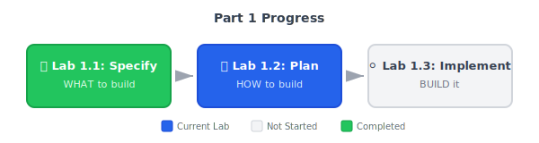

# Lab 1.2: From Spec to Implementation Plan

**Duration**: 45 minutes  
**Day**: 1  
**Prerequisites**: Completed Lab 1.1 with `specs/001-payment-checkout/spec.md`

---

## Learning Objective

Use `/speckit.plan` to transform your specification into a complete implementation plan. This single command generates research documentation, architecture decisions, data models, and API contracts — everything needed before writing code.

By the end of this lab, you'll understand: **A plan is a commitment. Research documents why you made that commitment.**

---

## The SDD Workflow



---

## Starting Point

- Repository with `specs/001-payment-checkout/spec.md` from Lab 1.1
- All `[NEEDS CLARIFICATION]` markers resolved
- AI assistant configured (`specify init .` completed)

---

## Step 1: Generate Implementation Plan (15 min)

The `/speckit.plan` command takes your spec and generates a complete implementation blueprint. You provide the technology preferences:

```
/speckit.plan Use Python with FastAPI for the REST API. 
Use Redis for idempotency caching. 
Keep it simple - this is for a demo, not production scale.
```

### What Gets Generated?

The command creates multiple artifacts in your feature directory:

| File | Purpose |
|------|---------|
| `plan.md` | Architecture, tech stack, project structure |
| `research.md` | Technology options analyzed, trade-offs documented |
| `data-model.md` | Entity definitions, relationships |
| `contracts/api.json` | API endpoint specifications |
| `quickstart.md` | Example usage and test flows |

### The Key Insight: Research Is Built-In

Unlike traditional workflows where you research separately, `/speckit.plan` **does research as part of planning**. It analyzes your spec, considers alternatives, and documents why it recommends specific technologies.

Open `specs/001-payment-checkout/research.md` and you'll see:

```markdown
## Technology Decision: Idempotency Cache

### Options Analyzed

| Option | Pros | Cons |
|--------|------|------|
| Redis | TTL built-in, fast, distributed | External dependency |
| In-memory dict | Simple, no deps | Lost on restart |
| Database | Persistent | Overkill for short TTL |

### Decision: Redis

**Rationale**: Native TTL support matches our 60-second cache requirement. 
For demo purposes, a single Redis instance is sufficient.

**Alternatives rejected**: In-memory caching would work for a single-server demo 
but doesn't demonstrate production patterns.
```

**This is your audit trail.** When someone asks "why Redis?", point them to research.md.

---

## Step 2: Review Your Plan (10 min)

Open `specs/001-payment-checkout/plan.md` and verify it contains:

### 2a. Committed Decisions

```markdown
## Technology Stack

- **Framework**: FastAPI (async, OpenAPI docs built-in)
- **Caching**: Redis (idempotency keys with TTL)
- **HTTP Client**: httpx (async gateway calls)
- **Logging**: structlog (JSON format for audit)
```

### 2b. Project Structure

```markdown
## Project Structure

src/
├── app/
│   ├── __init__.py
│   ├── main.py          # FastAPI entry point
│   ├── models.py        # Pydantic request/response models
│   ├── payment.py       # Payment service logic
│   └── config.py        # Environment configuration
└── tests/
    ├── __init__.py
    └── test_payment.py  # API tests
```

### 2c. Traceability Check

**Every technology should trace to your spec.** Ask yourself:

| Decision | Why? (Spec Reference) |
|----------|----------------------|
| FastAPI | Need REST API for checkout endpoint |
| Redis | Idempotency requirement (FR-002) |
| httpx | Call mock payment gateway |
| structlog | Audit logging requirement (FR-003) |

If you can't justify a technology from your spec, either:
- Add the missing requirement to spec.md, OR
- Remove the unnecessary technology

---

## Step 3: Review Data Model (5 min)

Open `specs/001-payment-checkout/data-model.md`:

```markdown
# Data Model: Payment Checkout

## Entities

### PaymentRequest
- idempotency_key: string (unique)
- amount: decimal
- currency: string (default: USD)
- payment_token: string
- created_at: timestamp

### PaymentResponse  
- transaction_id: string
- status: enum (success, failed, pending)
- amount: decimal
- processed_at: timestamp
```

**Verify**: Do these entities cover your spec's requirements?

---

## Step 4: Verify Infrastructure (5 min)

The template includes `docker-compose.yml`. Start the services:

```bash
# Start Redis and Mock Payment Gateway
docker-compose up -d

# Verify Redis is running
docker-compose exec redis redis-cli ping
# Expected: PONG

# Verify Mock Payment Gateway
curl http://localhost:8001/health
# Expected: {"status":"healthy"}
```

---

## Step 5: Run Consistency Check (Optional) (5 min)

Before proceeding to implementation, you can validate that your plan is consistent with your spec:

```
/speckit.analyze
```

This checks:
- ✓ All spec requirements have corresponding plan elements
- ✓ No plan elements without spec justification
- ✓ Data model covers all entities mentioned in spec
- ✓ API contracts match spec scenarios

If issues are found, fix them before Lab 1.3.

---

## Step 6: Commit Your Work (5 min)

**Where does this commit go?** To YOUR repository copy (same as Lab 1.1).

```bash
git add .
git commit -m "feat: implementation plan for payment checkout"
```

This commit includes:
- `specs/001-payment-checkout/plan.md`
- `specs/001-payment-checkout/research.md`
- `specs/001-payment-checkout/data-model.md`
- `specs/001-payment-checkout/contracts/` (if generated)

---

## Success Criteria

Your lab is complete when:

- [ ] `specs/001-payment-checkout/plan.md` exists with technology decisions
- [ ] `specs/001-payment-checkout/research.md` exists with trade-offs documented
- [ ] `specs/001-payment-checkout/data-model.md` exists with entities defined
- [ ] Every technology choice traces back to a spec requirement
- [ ] `docker-compose up` starts Redis and Mock Payment Gateway
- [ ] Commit includes plan.md and research.md

---

## Plan vs. Research: Understanding the Difference

| research.md | plan.md |
|-------------|---------|
| "We considered X, Y, Z" | "We will use X" |
| Documents trade-offs | Documents commitments |
| Answers "why not Y?" | Answers "what are we building?" |
| Audit trail for decisions | Implementation blueprint |

**Both are generated by `/speckit.plan`** — research explores options, plan commits to decisions.

---

## Key Takeaways

1. **One command, multiple artifacts** — `/speckit.plan` generates plan.md, research.md, data-model.md, and contracts in one step.

2. **Research is built into planning** — You don't need a separate research phase; the AI analyzes options as part of planning.

3. **Traceability matters** — Every technology choice should trace to a spec requirement. If it doesn't, question whether you need it.

4. **Plans are commitments** — Once you commit to a plan, changes should go through the spec → plan → implementation cycle.

---

## Preview: External Research Tools (Course 2)

In greenfield projects, your AI assistant's training data is usually sufficient for planning. But in **brownfield enterprise work** (Course 2), you'll need live, authoritative sources:

| Tool | Use During Planning | Example |
|------|---------------------|---------|
| **Context7** | Library documentation | "What's the current FastAPI best practice for dependency injection?" |
| **Perplexity** | Security advisories, version compatibility | "Any critical CVEs for Redis 7.x in the last 6 months?" |
| **Confluence/SharePoint** | Company-approved tech lists | "Which caching solutions are on our approved vendor list?" |

### Why This Matters in Brownfield

When you're integrating with **existing systems** (Course 2), you can't rely on general knowledge:
- Legacy systems have specific version constraints
- Company policies restrict technology choices
- Security teams require CVE verification

**For now**: Your AI assistant handles research automatically via `/speckit.plan`.

**In Course 2**: You'll learn to integrate MCP tools (Context7, Perplexity) for verified, up-to-date research — especially critical when working with legacy codebases.

---

## What's Next?

In **Lab 1.3**, you'll use `/speckit.tasks` to break down the plan into implementable tasks, then use `/speckit.implement` to generate your payment endpoint.

**The plan says HOW. Tasks say IN WHAT ORDER.**

**Remember**: You're building toward Thursday. The plan is your implementation contract — Lab 1.3 implements exactly what's documented.
