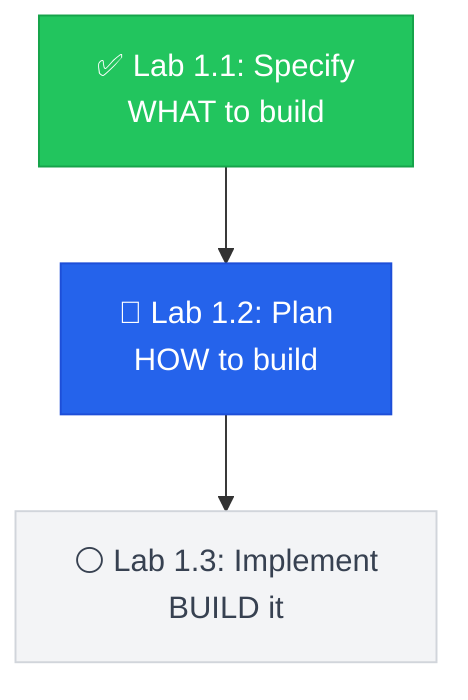

# Lab 1.2: From Spec to Implementation Plan

**Duration**: 45 minutes  
**Day**: 1  
**Prerequisites**: Completed Lab 1.1 with `specs/001-payment-checkout/spec.md`

---

## Learning Objective

Use `/speckit.plan` to transform your specification into a complete implementation plan. This single command generates research documentation, architecture decisions, data models, and API contracts — everything needed before writing code.

By the end of this lab, you'll understand: **A plan is a commitment. Research documents why you made that commitment.**

---

## The SDD Workflow



---

## Starting Point

- Repository with `specs/001-payment-checkout/spec.md` from Lab 1.1
- All `[NEEDS CLARIFICATION]` markers resolved
- AI assistant configured (`specify init .` completed)

---

## Step 1: Generate Implementation Plan (15 min)

The `/speckit.plan` command takes your spec and generates a complete implementation blueprint. You provide the technology preferences:

```
/speckit.plan Use Python with FastAPI for the REST API. 
Use Redis for idempotency caching. 
Keep it simple - this is for a demo, not production scale.
```

### What Gets Generated?

The command creates multiple artifacts in your feature directory:

| File | Purpose |
|------|---------|
| `plan.md` | Architecture, tech stack, project structure |
| `research.md` | Technology options analyzed, trade-offs documented |
| `data-model.md` | Entity definitions, relationships |
| `contracts/api.json` | API endpoint specifications |

### The Key Insight: Research Is Built-In

Unlike traditional workflows where you research separately, `/speckit.plan` **does research as part of planning**. It analyzes your spec, considers alternatives, and documents why it recommends specific technologies.

Open `specs/001-payment-checkout/research.md` and you'll see:

```markdown
## Technology Decision: Idempotency Cache

### Options Analyzed

| Option | Pros | Cons |
|--------|------|------|
| Redis | TTL built-in, fast, distributed | External dependency |
| In-memory dict | Simple, no deps | Lost on restart |
| Database | Persistent | Overkill for short TTL |

### Decision: Redis

**Rationale**: Native TTL support matches our cache requirement. 
For demo purposes, a single Redis instance is sufficient.
```

**This is your audit trail.** When someone asks "why Redis?", point them to research.md.

---

## Step 2: Review Your Plan (10 min)

Open `specs/001-payment-checkout/plan.md` and verify it contains:

### 2a. Committed Decisions

```markdown
## Technology Stack

- **Framework**: FastAPI (async, OpenAPI docs built-in)
- **Caching**: Redis (idempotency keys with TTL)
- **HTTP Client**: httpx (async gateway calls)
- **Logging**: structlog (JSON format for audit)
```

### 2b. Project Structure

```markdown
## Project Structure

src/
├── app/
│   ├── main.py          # FastAPI entry point
│   ├── models.py        # Pydantic models
│   ├── payment.py       # Payment service
│   └── config.py        # Configuration
└── tests/
    └── test_payment.py  # API tests
```

### 2c. Traceability Check

**Every technology should trace to your spec:**

| Decision | Why? (Spec Reference) |
|----------|----------------------|
| FastAPI | Need REST API for checkout endpoint |
| Redis | Idempotency requirement (FR-002) |
| httpx | Call mock payment gateway |
| structlog | Audit logging requirement (FR-003) |

If you can't justify a technology from your spec, either add the requirement or remove the technology.

---

## Step 3: Review Data Model (5 min)

Open `specs/001-payment-checkout/data-model.md`:

```markdown
# Data Model: Payment Checkout

## Entities

### PaymentRequest
- idempotency_key: string (unique)
- amount: decimal
- currency: string
- payment_token: string

### PaymentResponse  
- transaction_id: string
- status: enum (success, failed, pending)
- amount: decimal
```

**Verify**: Do these entities cover your spec's requirements?

---

## Step 4: Verify Infrastructure (5 min)

Start the services:

```bash
# Start Redis and Mock Payment Gateway
docker-compose up -d

# Verify Redis
docker-compose exec redis redis-cli ping
# Expected: PONG

# Verify Mock Gateway
curl http://localhost:8001/health
# Expected: {"status":"healthy"}
```

---

## Step 5: Run Consistency Check (Optional) (5 min)

Validate your plan is consistent with your spec:

```
/speckit.analyze
```

This checks:
- ✓ All spec requirements have plan elements
- ✓ Data model covers all entities
- ✓ API contracts match spec scenarios

---

## Step 6: Commit Your Work (5 min)

```bash
git add .
git commit -m "feat: implementation plan for payment checkout"
```

---

## Success Criteria

Your lab is complete when:

- [ ] `specs/001-payment-checkout/plan.md` exists with technology decisions
- [ ] `specs/001-payment-checkout/research.md` exists with trade-offs documented
- [ ] `specs/001-payment-checkout/data-model.md` exists with entities defined
- [ ] Every technology choice traces back to a spec requirement
- [ ] `docker-compose up` starts Redis and Mock Payment Gateway
- [ ] Commit includes plan.md and research.md

---

## Plan vs. Research: Understanding the Difference

| research.md | plan.md |
|-------------|---------|
| "We considered X, Y, Z" | "We will use X" |
| Documents trade-offs | Documents commitments |
| Answers "why not Y?" | Answers "what are we building?" |
| Audit trail for decisions | Implementation blueprint |

**Both are generated by `/speckit.plan`** — research explores, plan commits.

---

## Key Takeaways

1. **One command, multiple artifacts** — `/speckit.plan` generates plan.md, research.md, and data-model.md together.

2. **Research is built into planning** — No separate research phase needed.

3. **Traceability matters** — Every technology choice should trace to a spec requirement.

4. **Plans are commitments** — Changes should go through spec → plan → implementation.

---

## Preview: External Research Tools (Course 2)

In greenfield projects, your AI assistant's training data is usually sufficient. But in **brownfield enterprise work** (Course 2), you'll need live, authoritative sources:

| Tool | Use Case |
|------|----------|
| **Context7** | Up-to-date library documentation |
| **Perplexity** | Security advisories, version compatibility |
| **Confluence/SharePoint** | Company-approved tech lists |

**For now**: Your AI handles research automatically via `/speckit.plan`.

**In Course 2**: You'll learn to integrate MCP tools for verified research — essential when working with legacy codebases.

---

## What's Next?

In **Lab 1.3**, you'll use `/speckit.tasks` to break down the plan into implementable tasks, then use `/speckit.implement` to generate your payment endpoint.

**The plan says HOW. Tasks say IN WHAT ORDER.**
