---
title: "Lab 1.3: Implementation"
layout: default
parent: Labs
nav_order: 4
---
# Lab 1.3: First Working Implementation

**Duration**: 90 minutes  
**Day**: 1 (Afternoon)  
**Prerequisites**: Completed Lab 1.2 with plan.md and research.md

---

## Learning Objective

Turn your spec into working code using `/speckit.tasks` and `/speckit.implement`. By the end, you'll have a demoable payment endpoint — including double-click protection that Lab 0 lacked.

---

## The SDD Workflow

```mermaid
flowchart TB
    A["✅ Lab 1.1: Specify<br/>WHAT to build"] --> B["✅ Lab 1.2: Plan<br/>HOW to build"]
    B --> C["🔵 Lab 1.3: Implement<br/>BUILD it"]
    C --> D["⚪ Lab 1.4: Scale<br/>Second feature"]
    
    style A fill:#22c55e,stroke:#16a34a,color:#fff
    style B fill:#22c55e,stroke:#16a34a,color:#fff
    style C fill:#2563eb,stroke:#1d4ed8,color:#fff
    style D fill:#f3f4f6,stroke:#d1d5db,color:#374151
```



---

## Starting Point

From Lab 1.2:
- `specs/001-payment-checkout/spec.md` — demo scenarios
- `specs/001-payment-checkout/plan.md` — technology decisions
- `specs/001-payment-checkout/research.md` — trade-off documentation
- `specs/001-payment-checkout/data-model.md` — entity definitions

**Note**: No code yet. This lab creates it.

---

## Step 1: Generate Task Breakdown (10 min)

```
/speckit.tasks
```

Creates `tasks.md` with dependency-ordered tasks.

---

## Step 2: Execute Implementation (45 min)

```
/speckit.implement
```

Watch the AI create:
- `src/app/main.py` — FastAPI entry point
- `src/app/models.py` — Pydantic models
- `src/app/payment.py` — Payment endpoint
- `tests/test_payment.py` — Acceptance tests
- `docker-compose.yml` — Infrastructure

---

## Step 3: Start Infrastructure (5 min)

> "Start the Docker services and verify Redis and the Mock Gateway are healthy."

AI runs `docker-compose up -d` and verifies both services.

---

## Step 4: Run Tests (10 min)

> "Run the test suite. All acceptance scenarios should pass."

AI runs `pytest tests/ -v` and reports results.

---

## Step 5: Validate with Checklist (5 min)

```
/speckit.checklist
```

Address any gaps the AI identifies.

---

## Step 6: Verify End-to-End (10 min)

> "Start the API and test the payment endpoint. Send a $50 payment, then send the same request again to verify double-click protection."

AI tests and confirms:
- First request: Success with transaction_id
- Second request: Same response with `"duplicate": true`

---

## Step 7: Commit Your Work (5 min)

```bash
git add .
git commit -m "feat: payment endpoint with idempotency and audit logging"
```

---

## Success Criteria

- [ ] `tasks.md` exists with task breakdown
- [ ] `src/app/payment.py` exists with POST /pay endpoint
- [ ] `tests/test_payment.py` has acceptance tests
- [ ] `pytest tests/ -v` passes
- [ ] `/speckit.checklist` shows no critical gaps
- [ ] Double-click protection works

---

## Key Takeaways

1. **Spec → Tasks → Code** — `/speckit.tasks` breaks down the spec, `/speckit.implement` generates code.

2. **Compare to Lab 0** — Your endpoint handles double-clicks. Lab 0's didn't.

3. **Natural language drives everything** — You described requirements; the AI built them.

4. **Traceability = confidence** — Every function traces to an FR-xxx requirement.

---

## What's Next?

In **Lab 1.4**, PM asks for order history. You'll handle scope addition — with a spec.
