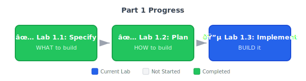

---
title: "Lab 1.3: Implementation"
layout: default
parent: "Part 1: Building from Scratch"
nav_order: 5
---
# Lab 1.3: First Working Implementation

**Duration**: 90 minutes  
**Day**: 1 (Afternoon)  
**Prerequisites**: Completed Lab 1.2 with plan.md and research.md

---

## Learning Objective

Turn your spec into working code using `/speckit.tasks` and `/speckit.implement`. By the end of this lab, you'll have a demoable payment endpoint that handles the scenarios you specified — including the double-click that would've crashed your Lab 0 code.

---

## The Spec-Driven Development Workflow



---

## Starting Point

From Lab 1.2, you have:
- `specs/001-payment-checkout/spec.md` with demo scenarios
- `specs/001-payment-checkout/plan.md` with technology decisions
- `specs/001-payment-checkout/research.md` with trade-off documentation
- `specs/001-payment-checkout/data-model.md` with entity definitions

**Note**: No code exists yet. This lab creates the implementation.

---

## Step 1: Generate Task Breakdown (10 min)

Break down the implementation plan into actionable tasks:

```text
/speckit.tasks
```

The command reads your spec and plan, then generates `specs/001-payment-checkout/tasks.md` with:
- Dependency-ordered tasks (what must come first)
- Phase groupings (Setup → Foundational → Feature → Polish)
- Parallel execution opportunities marked with `[P]`

### Review the Generated Tasks

Open `tasks.md` and verify it makes sense:

**Phase 1: Setup** (4 tasks)
- **T001**: Initialize FastAPI project structure
- **T002**: Configure Redis connection
- **T003**: Set up Mock Payment Gateway client
- **T004**: Create environment configuration

**Phase 2: Core Feature** (5 tasks)
- **T005**: Implement PaymentRequest/Response models
- **T006**: Implement idempotency cache service
- **T007**: Implement payment endpoint (POST /pay)
- **T008**: Add audit logging
- **T009**: Wire up error handling

**Phase 3: Validation** (3 tasks)
- **T010**: Write acceptance tests per spec scenarios
- **T011**: Run security scan (semgrep/bandit)
- **T012**: Verify end-to-end flow

**Key insight**: The AI broke down YOUR spec into tasks. Every task traces back to a requirement.

---

## Step 2: Execute Implementation (45-90 min)

Now let the AI implement the tasks:

```text
/speckit.implement
```

{: .note }
> **Timing varies**: Implementation time depends on project complexity. Simple specs may complete in 30 minutes; complex ones may take 60-90+ minutes. This is normal.

{: .tip }
> **Working with Copilot**: During implementation, Copilot will:
> - Request approval for each command (click "Allow" or "Continue")
> - Periodically ask "Continue to iterate?" — click "Continue" to proceed
> - Show progress as it creates files and runs tests
>
> For a smoother experience, you can approve commands in batches or enable auto-approval in Copilot settings.

This command:
1. Reads `tasks.md` for the task order
2. Implements each task following TDD approach
3. Validates against checklists as it progresses
4. Creates code that traces to spec requirements

### What Gets Created

Watch as the AI creates:
- `src/app/main.py` — FastAPI entry point
- `src/app/models.py` — Pydantic models per data-model.md
- `src/app/payment.py` — Payment endpoint with idempotency
- `src/app/config.py` — Environment configuration
- `tests/test_payment.py` — Acceptance scenario tests
- `docker-compose.yml` — Redis + Mock Gateway services

### Monitor Progress

The AI will show you what it's implementing. Look for:
- **FR-xxx references** — Code linking back to spec requirements
- **Scenario coverage** — Tests matching your Given/When/Then scenarios
- **Error handling** — Graceful failures per your edge cases

### Implementation Checkpoints

As implementation progresses, verify these milestones:

| Phase | Check | How to Verify |
|-------|-------|---------------|
| Setup | Project structure exists | `src/app/` directory created |
| Foundation | Models defined | `src/app/models.py` exists |
| Feature | Endpoint implemented | `src/app/payment.py` exists |
| Tests | Test file created | `tests/test_payment.py` exists |

If implementation seems stuck (no progress for 2+ minutes), you can:
1. Check the file explorer for newly created files
2. Ask Copilot: "What's the current implementation status?"
3. If needed, restart with: `/speckit.implement --continue`

---

## Step 3: Start Infrastructure (5 min)

```text
Start the Docker services (Redis and Mock Payment Gateway) and verify they're both running and healthy.
```

The AI will:
1. Run `docker-compose up -d`
2. Check Redis with `redis-cli ping`
3. Verify the Mock Gateway health endpoint
4. Report status back to you

**Expected**: AI confirms both services are healthy.

---

## Step 4: Run Tests (10 min)

```text
Run the test suite and show me the results. All acceptance scenarios from the spec should pass.
```

The AI will:
1. Run `pytest tests/ -v`
2. Show you which tests passed/failed
3. Link failures back to spec scenarios

**Expected**: All acceptance scenario tests pass.

If tests fail:

```text
Test for Scenario 2 (double-click protection) is failing. The spec says we should return the original response. Please fix.
```

---

## Step 5: Validate with Checklist (5 min)

Run the spec-kit validation:

```text
/speckit.checklist
```

This checks:
- ✓ All spec requirements have implementation
- ✓ All acceptance scenarios have tests
- ✓ Code coverage meets minimum threshold
- ✓ No critical security findings

### Address Any Gaps

If the checklist shows incomplete items:

```text
The checklist shows FR-003 (audit logging) isn't fully implemented. Please add structured logging for all payment events.
```

---

## Step 6: Verify End-to-End (10 min)

```text
Start the API server and test the payment endpoint. Send a $50 payment, then send the same request again to verify double-click protection returns the original response with duplicate=true.
```

The AI will:
1. Start the FastAPI server
2. Send a test payment request
3. Send a duplicate request (same idempotency key)
4. Verify the second request returns `"duplicate": true`

**Expected**: 
- First request: Success with transaction_id
- Second request: Same response with `"duplicate": true`

**This is the moment**: Lab 0 code would've created a duplicate charge. Your spec prevented it.

---

## Step 7: Commit Your Work (5 min)

```text
Commit all the implementation work with a conventional commit message describing the payment endpoint with idempotency and audit logging.
```

---

## Success Criteria

Your lab is complete when:

- [ ] `specs/001-payment-checkout/tasks.md` exists with task breakdown
- [ ] `src/app/payment.py` exists with POST /pay endpoint
- [ ] `src/app/models.py` has PaymentRequest, PaymentResponse, PaymentError
- [ ] `tests/test_payment.py` has tests for all acceptance scenarios
- [ ] `pytest tests/ -v` shows all tests passing
- [ ] `/speckit.checklist` shows no critical gaps
- [ ] Manual curl test shows double-click protection working

---

## Reflection Questions

1. **TDD experience**: Did watching the AI follow the RED-GREEN-REFACTOR cycle feel different from typical AI-generated code? Why?

2. **Traceability value**: Pick one endpoint. Can you trace it back to a specific FR-xxx requirement and a Given/When/Then scenario? How long would that trace take in Lab 0 code?

3. **Coverage confidence**: Your tests came from spec scenarios. How does that change your confidence in the 80% coverage number vs. AI-invented test cases?

4. **Lab 0 callback**: In Lab 0, how would you have known when "payment processing" was done? What was your definition of done?

---

## Key Takeaways

1. **Spec → Tasks → Code** — `/speckit.tasks` breaks down the spec, `/speckit.implement` generates traceable code.

2. **Compare to Lab 0** — Your endpoint handles double-clicks. Lab 0's didn't. The spec made the difference.

3. **Natural language drives everything** — You described requirements; the AI structured and implemented them.

4. **Traceability = confidence** — Every function traces to an FR-xxx requirement. That's "production-ready."

### Common Pitfalls

| Pitfall | Why It Matters |
|---------|---------------|
| Skipping `/speckit.tasks` | Implementation order matters; dependencies break |
| Not running tests | Can't prove it works |
| Ignoring checklist gaps | Incomplete coverage = demo risk |

---

## Preview: External Research Tools (Part 2)

During implementation, you might hit API questions your AI can't answer from training data:

| Situation | Tool | Example |
|-----------|------|--------|
| "How do I mock httpx in pytest?" | **Context7** | Get current httpx/pytest docs |
| "Is this Redis pattern safe?" | **Perplexity** | Search for known issues |

**For now**: Your AI handles most questions. The spec provides enough context.

**In Part 2**: You can integrate MCP tools for real-time documentation — especially useful when working with complex or frequently-updated APIs.

---

## What's Next?

It's **Wednesday morning**. PM walks over:

> "Great progress! The investors also want to see order history. Can you add that by Thursday?"

In **Lab 1.4**, you'll handle this scope addition — with a spec. No Thursday night panic.

**Your payment feature works. Now let's see if the discipline scales.**


