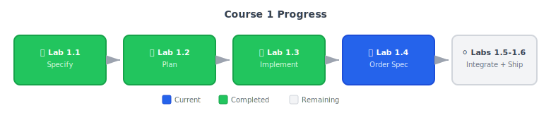

# Lab 1.4: Second Feature -- "Can You Also Add Order History?"

**Duration**: 120 minutes  
**Day**: 2 (Morning)  
**Prerequisites**: Completed Lab 1.3 with working payment endpoint

---

## Learning Objective

Handle the inevitable scope expansion -- PM wants "one more thing" before Thursday. Apply spec-first discipline to prevent the Thursday night scramble that would've killed you in the Lab 0 approach.

---

## Course Progress



---

## The Wednesday Morning Message

You're feeling good. Payment endpoint works. Demo scenarios pass. Then PM appears:

> "Great progress! The investors also want to see order history -- create orders, view past orders, track status. Can you add that by Thursday?"

**Without spec discipline**: Panic. Start coding. Thursday night rewrite.

**With spec discipline**: "Let me spec that out so I scope it correctly."

---

## Starting Point

- Working payment service from Lab 1.3
- Confidence in spec - plan - tasks - implement workflow
- PM requesting scope expansion

---

## Step 1: Scope the Request (5 min)

Before coding, clarify what "order history" means for the demo:

| PM Said | You Ask | Demo Scope |
|---------|---------|------------|
| "Create orders" | Before or after payment? | Create - Pay - See result |
| "View past orders" | How many? Pagination? | Show 3-5 recent orders |
| "Track status" | Real-time updates? | Status changes on refresh |

**For Friday's demo, you need**:
- Create order endpoint
- Mark order paid (after payment)
- Get order history
- Status display

---

## Step 2: Create Order Feature Spec (15 min)

Use `/speckit.specify` to create the order feature spec. This automatically:
- Creates `specs/002-order/` directory
- Creates a semantic feature branch
- Generates `spec.md` from template with your requirements

```text
/speckit.specify Order history feature for checkout flow. Customers create orders, submit payment, and view past orders. Orders track state (created, paid, fulfilled, cancelled). Need idempotent payment callbacks, order history queries, and state transition validation. Demo requires: create order, mark paid after payment, show order history. Governance: 7-year retention for financial audit, immutable audit trail.
```

{: .note }
> **What just happened?** The `/speckit.specify` command analyzed your description and generated a structured spec with user stories, acceptance scenarios, functional requirements, and key entities. Review the generated `specs/002-order/spec.md` to see the result.

---

## Step 3: Refine Constraints for Demoability (10 min)

Review the generated spec and enhance the constraints section. What could break the order history demo?

### Demo Disaster Prevention

Ask your AI to strengthen the constraints:

```text
/speckit.clarify Focus on state integrity constraints: valid transitions only, no stuck orders, idempotency for duplicate callbacks. Also clarify demo-day requirements: <500ms query response, clear status display, audit-ready history.
```

**State Integrity** (prevents demo disasters):
- **Valid transitions only**: Orders can only move through defined states
- **No stuck orders**: Every state has a path forward or is terminal
- **Idempotency**: Duplicate "mark paid" calls don't break anything

**Demo-Day Requirements**:
- **Fast queries**: Order history returns in < 500ms
- **Clear status**: Each order shows current state and timestamp
- **Audit ready**: "Can you show me the history of this order?" — yes

### Bonus: Production-Path Constraints

These aren't required for Friday, but make "production-ready" easier:

**Future-Proofing** (already in spec = no rework later):
- **7-year retention**: Financial records for audit compliance
- **Anonymization**: Personal data cleaned after retention period
- **Immutable audit trail**: Can't fake order history

**This is the power of spec-first**: Compliance comes free when you specify upfront.

---

## Step 4: Refine Demo Scenarios (15 min)

The generated spec includes acceptance scenarios. Review and refine them for Friday's demo.

### Demo Flow 1: Create Order and Pay

If the generated scenarios don't cover the complete checkout flow, use `/speckit.clarify` to add them:

```text
/speckit.clarify Add acceptance scenario for complete checkout flow: customer creates order, submits payment, order shows paid. Use Given/When/Then format with clear success criteria.
```

**Demo Flow 1: Complete Checkout** (the main demo)
1. **Given** a customer ready to checkout, **When** they create an order, **Then** order created with status "created" and unique ID.
2. **Given** an order with status "created", **When** payment succeeds (links to our payment endpoint), **Then** order moves to "paid", payment ID is linked.

*Demo script: "Customer creates order... submits payment... order shows paid."*

### Demo Flow 2: Order History

```text
/speckit.clarify Add acceptance scenario for viewing order history: user sees list of orders sorted by date, newly paid order appears at top. Use Given/When/Then format.
```

**Demo Flow 2: View Order History** (proves persistence)
1. **Given** a user with completed orders, **When** they view order history, **Then** see list of orders with status and dates.
2. **Given** an order was just paid, **When** user refreshes history, **Then** new order appears at top of list.

*Demo script: "Let's see the customer's order history... there it is."*

### Demo Flow 3: Error Handling (proves robustness)

```text
/speckit.clarify Add edge case scenarios for robustness: duplicate payment callback handled gracefully (idempotent), unauthorized order access rejected with 401. Use Given/When/Then format.
```

**Demo Flow 3: Edge Cases That Won't Crash**
1. **Given** an order already marked "paid", **When** payment callback fires again, **Then** graceful response (not duplicate, not error).
2. **Given** user requests someone else's orders, **When** request processed, **Then** rejected with "unauthorized" (not a crash).

*Demo script: "And if something goes wrong... helpful error, not a crash."*

---

## Step 5: Enhance State Machine Documentation (10 min)

The generated spec includes functional requirements. Ensure the order lifecycle state machine is clearly documented:

```text
/speckit.clarify Document the order lifecycle state machine with all valid state transitions. States: created, paid, fulfilled, cancelled, archived. Include which transitions are valid from each state and demo relevance.
```

**Functional Requirements** (Friday Demo):
- **FR-001**: Create order with unique ID and "created" status
- **FR-002**: Mark order paid when payment succeeds (link transaction_id)
- **FR-003**: Get order history for authenticated user
- **FR-004**: Enforce valid state transitions only
- **FR-005**: Log state changes to audit trail

**Order Lifecycle** (State Machine):

| State | Transitions To | Demo Relevance |
|-------|----------------|----------------|
| created | paid, cancelled | Initial state after checkout starts |
| paid | fulfilled | After successful payment |
| fulfilled | archived | Post-demo (delivery complete) |
| cancelled | (terminal) | Customer abandons |
| archived | (terminal) | Long-term storage |

**Why document states in spec?** Your AI will generate valid transition logic instead of spaghetti if-else chains.

---

## Step 6: Document Payment Integration (10 min)

This is where the two features connect:

```text
/speckit.clarify Document the integration contract between payment and order services. Include API contract for payment success callback (order_id, transaction_id payload) and failure handling strategy.
```

**Integration: Payment → Order**

*Flow:*
1. Customer creates order — Order in "created" state
2. Customer submits payment (to /pay endpoint)
3. Payment succeeds — Order service marks order "paid"

*API Contract:*

| Event | From | To | Payload |
|-------|------|-----|---------|
| Payment succeeded | Payment Service | Order Service | { order_id, transaction_id } |

*What If Payment Service Is Down?*
Order stays in "created" state. No cascading failure. Customer can retry.

**This is why you spec integration points**: Avoids "it worked in isolation" demo failures.

---

## Step 7: Edge Cases (10 min)

What could break the demo?

```text
/speckit.clarify Add edge cases for demo disaster prevention: double payment callback (idempotent), order not found (404), invalid state transition (reject with reason), unauthorized access (401), concurrent updates (optimistic locking).
```

**Edge Cases** (Demo Disaster Prevention):
- **Double payment callback**: Order already "paid" — return success, no state change
- **Order not found**: Return 404 with helpful error, not stack trace  
- **Invalid state transition**: Reject with "invalid_transition", log the attempt
- **Unauthorized access**: Return 401, don't leak order data
- **Concurrent updates**: Use optimistic locking, return "conflict" on race

---

## Step 8: Generate Plan (10 min)

```text
/speckit.plan Use the same tech stack as payment service (FastAPI, Redis). Add SQLite for order persistence. Include state machine library for transition validation.
```

The generated `specs/002-order/plan.md` should include:

1. Database schema for orders and audit trail
2. State machine implementation strategy
3. Integration approach with payment service
4. Test strategy for state transitions

---

## Step 9: Commit Your Work (2 min)

```text
Commit all the order specification work with a conventional commit message.
```

---

## Success Criteria

Your lab is complete when:

- [ ] `specs/002-order/spec.md` exists
- [ ] GOVERNANCE CONSTRAINTS section includes 7-year retention
- [ ] GOVERNANCE CONSTRAINTS section includes audit trail requirements
- [ ] Order lifecycle states are documented (created, paid, fulfilled, etc.)
- [ ] At least 3 acceptance scenarios (Given/When/Then)
- [ ] Integration with payment service documented
- [ ] `specs/002-order/plan.md` exists with technology decisions

### Validate Your Work

```text
Run the lab validation script for Lab 1.4 and show me the results.
```

---

## Reflection Questions

1. **Scope control**: PM asked for "order history." How did speccing it prevent scope creep?

2. **Integration planning**: What would have happened if you built order service without documenting the payment integration?

3. **State machine value**: Your AI will generate transition logic. What would it have generated without the state diagram?

4. **Contrast callback**: In Lab 0, if PM had asked for "one more thing" -- how would that have gone?

---

## Common Mistakes

| Mistake | What Happens Thursday |
|---------|----------------------|
| Missing state machine | AI generates invalid transitions |
| No integration spec | Payment and order don't connect |
| Skipping edge cases | Demo crashes on second payment attempt |
| Not scoping for demo | Build features you won't show |

---

## What's Next?

It's **Thursday morning**. You have:
- Payment spec + implementation (done)
- Order spec (done)

In **Lab 1.5**, you'll implement orders and integrate with payments. One day to build, test, and prove the full checkout flow works.

**The spec took 30 minutes. Without it, you'd still be figuring out what "order history" means.**
