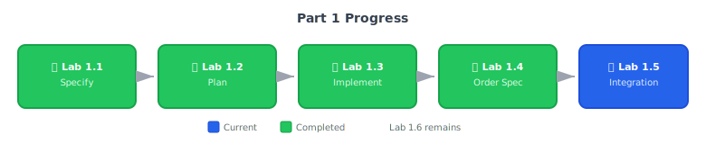

# Lab 1.5: Integrate Payment + Order -- Thursday Build Day

**Duration**: 110 minutes  
**Day**: 2 (Morning)  
**Prerequisites**: Completed Lab 1.4 with order specification

---

## Learning Objective

Build the order service, wire it to payments, and prove the full checkout flow works. By end of day Thursday, you'll have a complete demo: create order - pay - see order history.

---

## Course Progress



---

## Starting Point

- Working payment service from Lab 1.3
- Complete order specification from Lab 1.4
- Integration points documented

---

## Step 1: Generate Order Tasks (10 min)

Break down the order spec into actionable tasks:

```text
/speckit.tasks
```

The AI analyzes your spec and plan, then generates `specs/002-order/tasks.md` organized by phase:

**Phase 1: Setup** — Project structure, dependencies
**Phase 2: Foundational** — State machine, base models
**Phase 3: User Story 1** — Order creation and management
**Phase 4: User Story 2** — Payment integration
**Phase 5: Polish** — Error handling, audit trail

Each task includes:
- Unique identifier (T001, T002, etc.)
- Dependencies on other tasks
- `[P]` markers for tasks that can run in parallel
- Links back to spec requirements (FR-001, etc.)

**Review the generated tasks** — they should match the order spec's requirements and scenarios.

---

## Step 2: Run Pre-Implementation Analysis (5 min)

Before implementing, verify consistency:

```text
/speckit.analyze
```

This checks:
- ✓ All spec requirements have corresponding tasks
- ✓ Data model entities are covered
- ✓ Test tasks exist for acceptance scenarios
- ✓ No orphaned tasks without spec backing

**If gaps found**: The AI will suggest additions to tasks.md.

---

## Step 3: Execute Implementation (60 min)

Now let the AI implement everything:

```text
/speckit.implement
```

This command:
1. Reads `tasks.md` for the task order and dependencies
2. Implements each task following **Test-Driven Development**:
   - Writes tests first (RED)
   - Implements code to pass tests (GREEN)
   - Refactors if needed
3. Validates against your spec's acceptance scenarios
4. Creates code that traces back to FR-xxx requirements

### What Gets Created

Watch as the AI builds:
- `src/app/models.py` — Order models with OrderStatus enum
- `src/app/state_machine.py` — Valid transition enforcement
- `src/app/order.py` — Order endpoints with idempotency
- `tests/test_order.py` — Unit tests per acceptance scenarios
- `tests/test_integration.py` — E2E checkout flow test

### Monitor the TDD Cycle

For each task, the AI:
1. **RED**: Writes failing test based on spec scenario
2. **GREEN**: Implements minimum code to pass
3. **REFACTOR**: Cleans up while keeping tests green

**Key insight**: The spec scenarios become your tests. The AI doesn't guess what to test — it implements exactly what you specified.

---

## Step 4: Verify Infrastructure (5 min)

```text
Start Docker services and verify Redis and the API are running.
```

The AI will:
1. Run `docker-compose up -d`
2. Check Redis connectivity
3. Start the FastAPI server
4. Report health status

---

## Step 5: Run Test Suite (10 min)

```text
Run the full test suite with coverage. Target is 80%+.
```

**Expected**: All tests pass, coverage ≥ 80%

If tests fail:

```text
The test for [scenario] is failing. Fix it according to the spec.
```

---

## Step 6: Verify End-to-End Flow (10 min)

```text
Test the complete checkout flow: create an order, process payment, mark order paid, verify order history shows the paid order.
```

The AI will execute the full demo scenario:
1. **POST /orders** — Create order with items
2. **POST /pay** — Process payment
3. **PATCH /orders/{id}/pay** — Link payment to order
4. **GET /orders** — Verify order appears with "paid" status

**This is your Thursday demo rehearsal.**

---

## Step 7: Run Security Scan (5 min)

```text
/speckit.checklist security
```

Alternatively:

```text
Run semgrep and bandit security scans. Report any critical or high findings.
```

**Pass Criteria**: 0 CRITICAL, 0 HIGH

---

## Step 8: Commit Your Work (2 min)

```text
Commit all the order implementation with a conventional commit message.
```

---

## Success Criteria

Your lab is complete when:

- [ ] `src/app/order.py` exists with order endpoints
- [ ] `src/app/models.py` includes Order models and OrderStatus enum
- [ ] `tests/test_order.py` exists with order unit tests
- [ ] `tests/test_integration.py` exists with e2e checkout flow test
- [ ] State machine enforces valid transitions only
- [ ] `pytest --cov` shows 80%+ coverage
- [ ] E2E test passes: order - payment - order paid

---

## Reflection Questions

1. **Demo readiness**: Could you demo this to investors right now? What would you polish tonight?

2. **Integration confidence**: Without the integration spec in Lab 1.4, how long would debugging "payment and order don't connect" have taken?

3. **State machine win**: Did your AI generate valid transition logic? How much did the state diagram in the spec help?

4. **Lab 0 callback**: In the Lab 0 approach, where would you be right now? (Hint: probably fixing integration bugs)

---

## Common Mistakes

| Mistake | Demo Day Impact |
|---------|-----------------|
| No state machine validation | Invalid orders crash the demo |
| Missing audit entries | "Can you trace this?" -- "Uh..." |
| Tests mock everything | "Run it live" -- fails |
| Forgot to register router | 404 on demo day |
| Coverage < 80% | Untested path crashes |

---

## What's Next?

It's **Thursday evening**. Your checkout flow works. Tests pass. Demo scenarios verified.

In **Lab 1.6**, you'll package for production and do a final check. If all goes well, you'll have time for a beer before Friday.

**The Lab 0 code you would've been rewriting from scratch right now.**
