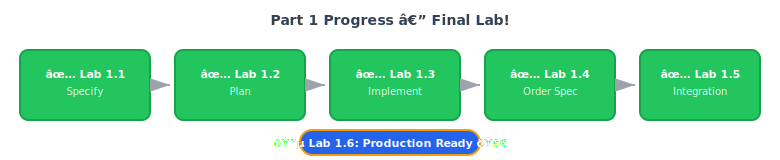

---
title: "Lab 1.6: Production Readiness"
layout: default
parent: "Part 1: Building from Scratch"
nav_order: 7
---
# Lab 1.6: Production Readiness  Friday Morning Polish

**Duration**: 75 minutes
**Day**: 2 (Final Lab)
**Prerequisites**: Completed Lab 1.5 with integrated features

---

## Learning Objective

Package for production, run final checks, and make sure nothing embarrassing happens during the demo. By end of this lab, you're ready for the Friday investor pitch.

**Key principle**: Production readiness is about confidence, not perfection.

---

## Course Progress

**Friday morning goal**: Production container, security check, demo rehearsal.

---

## Starting Point

- Working payment + order integration from Lab 1.5
- All tests passing with 80%+ coverage
- Demo scenarios verified

---

## Step 1: Create Production Dockerfile (15 min)

> "/speckit.implement Create a production Dockerfile with:
> - Multi-stage build (builder stage for dependencies, production stage for runtime)
> - Python 3.11-slim base image
> - Non-root user (appuser) for security
> - Virtual environment copied from builder
> - HEALTHCHECK that hits /health endpoint
> - Environment variables: PYTHONDONTWRITEBYTECODE=1, PYTHONUNBUFFERED=1
> - Expose port 8000, run with uvicorn"

### What AI Should Generate

| Pattern | Purpose |
|---------|---------|
| Multi-stage build | Smaller final image (no build tools) |
| Non-root user | Security best practice |
| HEALTHCHECK | Container orchestration support |
| PYTHONDONTWRITEBYTECODE | Avoid .pyc files in container |

### Your Verification

Open the generated `Dockerfile` and confirm:

- [ ] Two stages: `builder` and `production`
- [ ] `USER appuser` appears before `CMD`
- [ ] `HEALTHCHECK` instruction present
- [ ] No secrets or credentials in the file
- [ ] `COPY --chown=appuser:appgroup` for app code

---

## Step 2: Build and Test Container (10 min)

> "Build the Docker image tagged as sdd-workshop:latest. Then run it with Redis and payment gateway URLs pointing to host.docker.internal. Test the health endpoint."

### Verify Container

| Check | Expected |
|-------|----------|
| Build succeeds | No errors |
| Container starts | No crash on startup |
| Health endpoint | `{"status": "healthy"}` |
| Container size | < 200MB |

> "Check the container image size. Is it under 200MB?"

If over 200MB, ask AI to optimize:

> "The container is [X]MB. How can we reduce the size?"

---

## Step 3: Final Security Scan (10 min)

> "Run semgrep security scan on src/ with the security-audit config. Then run bandit. Report any CRITICAL or HIGH findings."

### Pass Criteria

| Tool | Threshold |
|------|-----------|
| Semgrep | 0 CRITICAL, 0 HIGH |
| Bandit | No high-severity issues |

If issues found:

> "Fix this security finding: [paste finding]"

### Optional: Container Security

> "If Trivy is available, scan the sdd-workshop:latest image for vulnerabilities."

---

## Step 4: CI/CD Pipeline (10 min)

> "/speckit.implement Create .github/workflows/ci.yml with:
> - Trigger on push/PR to main
> - Jobs: lint (ruff), security (semgrep + bandit), test (pytest with coverage), build (docker)
> - Test job needs Redis service container
> - Build job depends on lint, security, and test passing
> - Coverage threshold: 80%"

### Your Verification

Open `.github/workflows/ci.yml` and confirm:

- [ ] Four jobs: lint, security, test, build
- [ ] `needs: [lint, security, test]` on build job
- [ ] Redis service in test job
- [ ] `--cov-fail-under=80` in pytest command

> "Push a test commit and verify the CI pipeline runs."

---

## Step 5: Demo Day Checklist (10 min)

Run the final checklist:

> "/speckit.checklist"

### The "Would I Demo This?" Questions

**Security** (investor Q: "Is this secure?")
- [ ] No hardcoded secrets in code
- [ ] Environment variables for config
- [ ] Non-root user in container
- [ ] Security scan passing

**Reliability** (investor Q: "Will it crash?")
- [ ] Health check endpoint works
- [ ] Double-click handled gracefully (idempotency)
- [ ] Error responses are helpful, not stack traces

**Professionalism** (investor Q: "Is this real?")
- [ ] Structured JSON logging
- [ ] Trace IDs propagate through requests
- [ ] API docs auto-generated at /docs

---

## Step 6: Demo Rehearsal (15 min)

> "Start all services with docker-compose. Walk me through the demo:
> 1. Create an order with 2 items
> 2. Process payment
> 3. Mark order as paid
> 4. Show order history
> 5. Show what happens on double-click (idempotency)"

### Demo Script (Practice This)

| Step | What You Say | What You Show |
|------|--------------|---------------|
| 1 | "Customer adds items to cart..." | POST /orders response |
| 2 | "Customer submits payment..." | POST /pay response |
| 3 | "System confirms the order..." | PATCH /orders/{id}/pay |
| 4 | "Customer views their history..." | GET /orders |
| 5 | "And if they double-click?..." | Same response, no duplicate |

**Rehearse until it's smooth.** Know what to say at each step.

---

## Step 7: Commit and Breathe (5 min)

> "Commit all changes with message: feat: production-ready for demo day"

**You're ready for the Friday demo.**

---

## Success Criteria

- [ ] `Dockerfile` exists with multi-stage build
- [ ] `docker build` succeeds
- [ ] Container starts and health check passes
- [ ] Security scan: 0 CRITICAL, 0 HIGH
- [ ] CI/CD pipeline runs successfully
- [ ] Demo rehearsal runs smoothly
- [ ] **You'd confidently demo this to investors**

---

## The Week in Review

| Day | What Happened | Without Spec-Driven Development |
|-----|---------------|-------------|
| **Monday** | Wrote specs, made decisions | Started coding, made assumptions |
| **Tuesday** | Built payment, tests pass | Built something, "works on my machine" |
| **Wednesday** | Order spec in 30 min | "One more thing" panic |
| **Thursday** | Integration, full flow works | Still debugging payment |
| **Friday** | Demo rehearsal, confident | Hoping nothing crashes |

**The spec-first approach didn't slow you down. It prevented the Thursday night rewrite.**

---

## Reflection: Lab 0 Callback

Remember Day 1 morning? Lab 0?

| Then | Now |
|------|-----|
| 30 min of coding, wouldn't demo it | 2 days, confident demo |
| No idempotency | Double-click safe |
| "Is this secure?" '€” "Uh..." | "Yes, here's the spec" |
| Thursday night panic | Thursday night beer |

**The difference wasn't skill. It was approach.**

---

## What You've Accomplished

In two days, you transformed a vague PM request into:

-  Authoritative specifications with governance constraints
-  Researched technology decisions with documented trade-offs
-  Working payment endpoint with idempotency
-  Order service with state machine
-  Integrated checkout flow
-  80%+ test coverage
-  Security scan passing
-  Production-ready container
-  **A demo you're confident giving**

**Same effort as the Lab 0 approach. Different outcome.**

---

## The AI-Human Partnership (Course Summary)

| You Did | AI Did |
|---------|--------|
| Wrote specs with governance constraints | Generated code from specs |
| Made technology decisions | Implemented those decisions |
| Designed state machine | Coded transition logic |
| Defined test scenarios | Wrote test implementations |
| Verified correctness | Produced boilerplate |
| Owned the demo | Handled the syntax |

**The spec is the contract. AI implements it. You validate and demo.**

---

## Part 2 Preview: Transforming Legacy Code

Part 1 was the easy path: empty repo, full control.

In Part 2, you'll face the real world:

| Part 1: Building from Scratch | Part 2: Transforming Legacy Code |
|-------------------------------|----------------------------------|
| Empty repo | 5000+ lines of legacy code |
| You write the spec | Spec is hidden in the code |
| Full technology control | Tech debt constrains choices |
| Monday spec '†’ Friday ship | Extract spec FROM existing code |

### What You'll Learn in Part 2

- **Extract implicit specs** from working code
- **Refactor without breaking** production
- **Retrofit governance** to legacy systems
- **Query external systems** via MCP (Jira, Confluence, GitHub)

The spec-first thinking you learned here becomes **spec-extraction** thinking there.

{: .note }
> **Part 2: Transforming Legacy Code** is coming soon. The discipline you've learned in Part 1 transfers directly.

---

## Next Steps

1. **Demo day**: Nail the investor pitch
2. **Apply Spec-Driven Development**: Use this on your next work project
3. **Share**: Teach a teammate the spec-first approach
4. **Part 2**: Coming soon '€” learn to extract specs from legacy code
5. **Explore**: Check out the [Further Resources](/resources/) for continued learning

---

**Congratulations on completing Part 1: Building from Scratch!**

**Now go demo that checkout flow. **