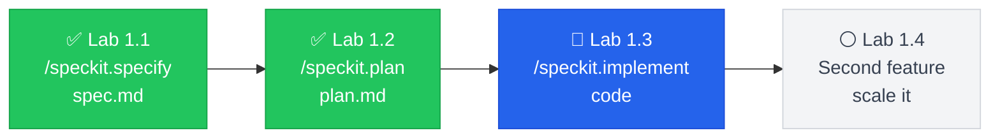

---
title: "Lab 1.3: Implementation"
layout: default
parent: Labs
nav_order: 4
---
# Lab 1.3: First Working Implementation -- Tuesday/Wednesday Build

**Duration**: 120 minutes  
**Day**: 1 (Afternoon)  
**Prerequisites**: Completed Lab 1.2 with project scaffold in place

---

## Learning Objective

Turn your spec into working code using `/speckit.tasks` and `/speckit.implement`. By the end of this lab, you'll have a demoable payment endpoint that handles the scenarios you specified -- including the double-click that would've crashed your Lab 0 code.

---

## The SDD Workflow



**You are here**: Building the code

---

## Starting Point

- Scaffolded project from Lab 1.2
- `specs/001-payment/spec.md` with demo scenarios
- `specs/001-payment/plan.md` with technology decisions
- `src/app/main.py` with FastAPI entry point
- `docker-compose.yml` with Redis + Mock Payment Gateway running

---

## Step 1: Generate Task Breakdown (15 min)

Break down the spec into implementation tasks:

```bash
/speckit.tasks
```

Or use your AI assistant:

> "Based on specs/001-payment/spec.md and plan.md, create a tasks.md with implementation tasks. Break down the work so I can ship incrementally."

The generated `specs/001-payment/tasks.md` should contain:

1. **Models first**: Can't break anything, get types right
2. **Config**: Environment setup
3. **Core endpoint**: The main feature
4. **Tests**: Prove it works before demo
5. **Security check**: Catch issues before Thursday

---

## Step 2: Understand Task Dependencies (10 min)

Review the task breakdown and understand the order:

```
models.py (no dependencies)
    |
    v
config.py (no dependencies)
    |
    v
payment.py (depends on models.py, config.py)
    |
    v
test_payment.py (depends on payment.py)
    |
    v
security scan (depends on all code)
```

**Key Question**: Which tasks can run in parallel? Which must be sequential?

---

## Step 3: Implement Models First (15 min)

Run implementation for the models task:

```bash
/speckit.implement
```

Or use your AI assistant:

> "Implement src/app/models.py based on the spec. Include PaymentRequest, PaymentResponse, and PaymentError models per the acceptance scenarios."

Your `src/app/models.py` should include:

```python
from pydantic import BaseModel, Field
from typing import Optional
from datetime import datetime
from enum import Enum


class TransactionStatus(str, Enum):
    PENDING = "pending"
    SUCCEEDED = "succeeded"
    FAILED = "failed"


class PaymentRequest(BaseModel):
    """Payment request per FR-001, FR-002, FR-005, FR-006."""
    
    token: str = Field(..., description="Payment token from Mock Gateway")
    amount: int = Field(..., gt=0, description="Amount in cents (positive)")
    currency: str = Field(default="usd", pattern="^[a-z]{3}$")
    idempotency_key: str = Field(..., min_length=1, max_length=255)


class PaymentResponse(BaseModel):
    """Payment response per acceptance scenarios."""
    
    transaction_id: str
    status: TransactionStatus
    amount: int
    currency: str
    duplicate: bool = False
    created_at: datetime = Field(default_factory=datetime.utcnow)


class PaymentError(BaseModel):
    """Error response per edge cases."""
    
    error_code: str  # e.g., "invalid_token", "idempotency_key_required"
    message: str
    details: Optional[dict] = None
```

---

## Step 4: Implement Configuration (10 min)

Create `src/app/config.py`:

```python
from pydantic_settings import BaseSettings


class Settings(BaseSettings):
    """Application settings from environment variables."""
    
    redis_url: str = "redis://localhost:6379"
    payment_gateway_url: str = "http://localhost:8001"
    idempotency_ttl: int = 60  # seconds
    log_level: str = "INFO"
    
    class Config:
        env_file = ".env"


settings = Settings()
```

---

## Step 5: Implement Payment Endpoint (30 min)

This is the core task. Run implementation:

```bash
/speckit.implement
```

> "Implement src/app/payment.py with the POST /pay endpoint. Follow the spec acceptance scenarios exactly. Use Redis for idempotency and httpx for Mock Payment Gateway calls."

Your implementation should handle:

1. **Idempotency check** (FR-002, FR-004)
2. **Token validation** (FR-001)
3. **Gateway call** (FR-001, FR-007)
4. **Response caching** (FR-004)
5. **Audit logging** (FR-003)

**Critical Code Pattern**:

```python
@app.post("/pay")
async def process_payment(request: PaymentRequest):
    # 1. Check idempotency cache
    cached = await redis_client.get(f"idempotency:{request.idempotency_key}")
    if cached:
        logger.info("duplicate_request", idempotency_key=request.idempotency_key)
        response = json.loads(cached)
        response["duplicate"] = True
        return response
    
    # 2. Call Mock Payment Gateway
    async with httpx.AsyncClient() as client:
        gateway_response = await client.post(
            f"{settings.payment_gateway_url}/charge",
            json={
                "token": request.token,
                "amount": request.amount,
                "currency": request.currency,
                "idempotency_key": request.idempotency_key,
            },
        )
    
    # 3. Handle response
    if gateway_response.status_code == 200:
        result = gateway_response.json()
        # 4. Cache for idempotency
        await redis_client.setex(
            f"idempotency:{request.idempotency_key}",
            settings.idempotency_ttl,
            json.dumps(result),
        )
        # 5. Log for audit
        logger.info("payment_processed", **result)
        return result
    else:
        # Handle gateway errors per FR-007
        ...
```

---

## Step 6: First Security Scan -- Attempt 1 (10 min)

Run the security scan:

```bash
# Run Semgrep
semgrep --config p/security-audit src/

# Run Bandit
bandit -r src/
```

**Expected First Attempt Results**: You'll likely see findings related to:
- Hardcoded URLs (INFO, not blocking)
- Missing error handling (WARNING)
- Logging sensitive data (ERROR - if you logged tokens!)

### Address Blocking Issues

If you see **ERROR** or **WARNING** findings:

1. Review the finding details
2. Update code to address the issue
3. Re-run scan

**Example Fix**: If Semgrep flags `logger.info("request", token=request.token)`:

```python
# Before (flagged)
logger.info("request", token=request.token)

# After (compliant)
logger.info("request", token_present=bool(request.token))
```

---

## Step 7: Second Security Scan -- Attempt 2 (10 min)

After fixing the first round:

```bash
semgrep --config p/security-audit src/
bandit -r src/
```

**Expected Second Attempt Results**: Fewer findings, possibly some INFO-level issues remaining.

**Governance Requirement**: Per security governance, you need **0 CRITICAL + 0 HIGH** findings to pass.

---

## Step 8: Final Security Scan -- Attempt 3 (5 min)

If any blocking issues remain, address them:

```bash
semgrep --config p/security-audit src/
bandit -r src/
```

**Pass Criteria**: 
- 0 CRITICAL findings
- 0 HIGH findings
- INFO/LOW findings are acceptable (documented)

**If you exceed 3 attempts**: 
1. Document the blockers
2. Ask instructor for help
3. Use checkpoint repository to continue

---

## Step 9: Implement Tests (15 min)

Create `tests/test_payment.py`:

```python
import pytest
from httpx import AsyncClient
from unittest.mock import patch, AsyncMock

from src.app.main import app


@pytest.mark.asyncio
async def test_successful_payment():
    """Acceptance scenario 1: Valid token - succeeded status."""
    async with AsyncClient(app=app, base_url="http://test") as client:
        response = await client.post(
            "/pay",
            json={
                "token": "tok_valid_test",
                "amount": 5000,
                "currency": "usd",
                "idempotency_key": "test-key-123",
            },
        )
    
    assert response.status_code == 200
    data = response.json()
    assert data["status"] == "succeeded"
    assert data["amount"] == 5000


@pytest.mark.asyncio
async def test_duplicate_request():
    """Acceptance scenario 2: Same idempotency key - original response."""
    async with AsyncClient(app=app, base_url="http://test") as client:
        # First request
        response1 = await client.post(
            "/pay",
            json={
                "token": "tok_valid_test",
                "amount": 5000,
                "currency": "usd",
                "idempotency_key": "duplicate-key-456",
            },
        )
        
        # Duplicate request
        response2 = await client.post(
            "/pay",
            json={
                "token": "tok_another",  # Different token
                "amount": 5000,
                "currency": "usd",
                "idempotency_key": "duplicate-key-456",  # Same key
            },
        )
    
    assert response2.json()["duplicate"] == True
    assert response1.json()["transaction_id"] == response2.json()["transaction_id"]


@pytest.mark.asyncio
async def test_missing_idempotency_key():
    """Acceptance scenario 4: No idempotency key - rejected."""
    async with AsyncClient(app=app, base_url="http://test") as client:
        response = await client.post(
            "/pay",
            json={
                "token": "tok_valid",
                "amount": 5000,
                "currency": "usd",
                # Missing idempotency_key
            },
        )
    
    assert response.status_code == 422  # Validation error
```

---

## Step 10: Run Tests with Coverage (10 min)

```bash
# Run tests with coverage
pytest --cov=src --cov-report=term-missing

# Expected output:
# TOTAL    xxx    xxx    60%+
```

**Pass Criteria**: Minimum 60% code coverage

If coverage is low:
1. Add tests for edge cases (invalid token, zero amount)
2. Add tests for error handling paths
3. Re-run coverage check

---

## Step 11: Verify End-to-End (5 min)

```bash
# Ensure services are running
docker-compose up -d

# Wait for healthy status
sleep 15

# Get a test token
curl -X POST http://localhost:8001/tokenize \
  -H "Content-Type: application/json" \
  -d '{"card_number": "4242424242424242", "exp_month": 12, "exp_year": 2025, "cvc": "123"}'

# Process payment with the token
curl -X POST http://localhost:8000/pay \
  -H "Content-Type: application/json" \
  -d '{"token": "tok_xxx", "amount": 5000, "currency": "usd", "idempotency_key": "manual-test-001"}'
```

---

## Step 12: Commit Your Work (2 min)

```bash
git add .
git commit -m "feat: payment endpoint with idempotency and audit logging"
```

---

## Success Criteria

Your lab is complete when:

- [ ] `specs/001-payment/tasks.md` exists with task breakdown
- [ ] `src/app/payment.py` exists with POST /pay endpoint
- [ ] `src/app/models.py` has PaymentRequest, PaymentResponse, PaymentError
- [ ] `tests/test_payment.py` exists with acceptance scenario tests
- [ ] `semgrep` shows 0 critical + 0 high findings
- [ ] `pytest --cov` shows 60%+ coverage
- [ ] `curl localhost:8000/pay` returns valid response

### Validate Your Work

```
/speckit.checklist
```

This validates your implementation against the spec requirements and confirms all acceptance scenarios are covered.

---

## Key Takeaways

1. **Spec → Tasks → Code** — `/speckit.tasks` breaks down the spec, `/speckit.implement` generates code that traces to requirements.

2. **Compare to Lab 0** — Your payment endpoint handles double-clicks. Lab 0's didn't. The spec made the difference.

3. **Security is iterative** — Expect 2-3 scan cycles. That's normal. The spec helps you catch issues before demo day.

4. **Traceability = confidence** — Every function traces to an FR-xxx requirement. That's what "production-ready" means.

### Common Pitfalls

| Pitfall | Why It Matters |
|---------|---------------|
| Logging raw tokens | Security scan fails, demo blocked |
| Missing idempotency cache | Double-click = duplicate charge |
| Tests mock everything | Can't prove it actually works |

---

## Preview: External Research Tools (Course 2)

During implementation, you might hit API questions your AI can't answer from training data:

| Situation | Tool | Example |
|-----------|------|--------|
| "How do I mock httpx in pytest?" | **Context7** | Get current httpx/pytest docs |
| "Is this Redis pattern safe?" | **Perplexity** | Search for known issues |

**For now**: Your AI handles most questions. The spec provides enough context.

**In Course 2**: You'll integrate MCP tools for real-time documentation lookup — essential when working with unfamiliar legacy APIs.

---

## What's Next?

It's **Wednesday morning**. PM walks over:

> "Great progress! The investors also want to see order history. Can you add that by Thursday?"

In **Lab 1.4**, you'll handle this scope addition -- with a spec. No Thursday night panic.

**Your payment feature works. Now let's see if the discipline scales.**
